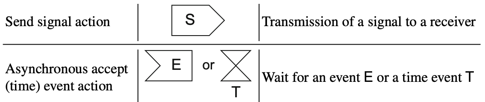

# Assignment #2

## C&#35;

Clone this repository and bring the code pieces you need into your BDSA Assignments GitHub repository.

### Exercise 1

In a new *class library* implement a *class* `Student` with the following properties:

- Id : `int`
- GivenName : `string`
- Surname : `string`
- Status : `Status` (enum: `New`, `Active`, `Dropout`, `Graduated`)
- StartDate : `DateTime`
- EndDate : `DateTime`
- GraduationDate : `DateTime`

And the following rules:

- Status is only readable - figure out the business rules given the three dates compared to `DateTime.Now`.
- Id can only be set when the class is created
- Implement a nice `ToString()` method

**Note**: Remember to do this Test-Driven - so create an xunit test library and implement the required tests there.

### Exercise 2

(cf. C#9N chapter 4 section *Records*)

Implement a new *record* `ImmutableStudent` with the same rules as above, only now all properties must be *immutable* like this:

```csharp
public string Property { get; init; }
```

Write a couple of tests where you test the built-in equality comparer and to string properties of a *record*.

### Exercise 3

Ensure that your new C# projects are attached to your solution and all tests are running in your GitHub action for PR.

### Exercise 4

Consider the three different constructs in C#:

1. Class
1. Struct
1. Record

Explain some of the key differences between the three and give examples of where you would use each of them.

Write your answers in the final .pdf file.

## Software Engineering

### Exercise 1

What is the difference between a scenario and a use case? When do you use each construct?

### Exercise 2

Draw a use case diagram for a ticket distributor for a train system. The system includes two actors: a traveler, who purchases different types of tickets, and a central computer system, which maintains a reference database for the tariff. Use cases should include: __BuyOneWayTicket__, __BuyWeeklyCard__, __BuyMonthlyCard__, __UpdateTariff__. Also include the following exceptional cases: __Time-Out__ (i.e., traveler took too long to insert the right amount), __TransactionAborted__ (i.e., traveler selected the cancel button without completing the transaction), __DistributorOutOfChange__, and __DistributorOutOfPaper__.

### Exercise 3

Draw a sequence diagram for the warehouseOnFire scenario of Figure 2-21. Include the objects __bob__, __alice__, __john__, __FRIEND__, and instances of other classes you may need. Draw only the first five message sends.

### Exercise 4

This year, the Analysis, Design, and Software Architecture course has re-introduced the group project and the entire process for accessing the exam with regards to the mandatory activities has changed. You have been tasked with drawing a UML diagram to depict the new process.
Looking at the slides from the first lecture, you have found all the information you needed to complete the task. Diligently, you have summarized all of them in the below bullet point list:

- After a student enrolls in the course, four mandatory activities (MA) require completion before being allowed to take the exam:
  - MA1 requires a student to participate to an exam simulation;
  - MA2 requires a student to submit and get approved 5 weekly;
  - MA3 requires a student to participarte to three project reviews;
  - MA4 requires a student to participarte to the project demo.
- Participation to MA1 needs to be confirmed by the teaching team.
- Each weekly activity submission needs to be verified by the teaching team.
- Participation to MA3 needs to be confirmed by the teaching team.
- Participation to MA4 needs to be confirmed by the teaching team.

Note: for the purpose of this task you must assume the following:

- The re-execution of mandatory activities must not be modelled. For instance, failing to participate to the exam simulation would require a student to take the second run of such activity. You must not model this detail.
- The number of Weekly activities can be arbitrary.
- Responsibility for the execution of activities must be modelled.
- No time constrain must be included, hence, a student could spent a lifetime completing the mandatory activities and project reviews before being accepted to the exam.

### Exercise 5

Using the solution for Exercise 4 and making use of event-based action (see below), include the process that describes:

- the teaching team sending the exam results to study administration (SAP);
- SAP registering the exams in the system;
- the students verifying their exam grade.

#### Event-based actions (from Section 7.2.1 in [1])

Event-based actions enable objects and signals to be transmitted to receiver objects. They allow you to distinguish between different types of events. You can use an __accept event action__ to model an action that waits for the occurrence of a specific event. The notation element for an accept event action is a "concave pentagon"---a rectangle with a tip that points inwards from the left. If the event is a time-based event, you can use an __accept time event action__, whereby in this case, the notation is an hourglass.

To send signals, you can use __send signal actions__. Send signal actions are denoted with a "convex pentagon"---a rectangle with a tip that protrudes to the right.



[1] Seidl, Martina, Marion Scholz, Christian Huemer, and Gerti Kappel. UML@ classroom: An introduction to object-oriented modeling. Springer, 2015.

### Exercise 6

Draw a class diagram that models the following specifications:

- Each project has a name, a start date, and an end date.
- Each project is associated to a project manager, a name, a telephone, and a team.
- The project manager manages (by starting and terminating) a project and leads the team associated with the project.
- The project receives as input the requirements and produces a system. Both requirements and the system have a completion percentage and a description.
- Each team is composed by developers.

### Exercise 7

Draw a state machine diagram that models your GitHub action configuration; include all triggers that you have defined.

### Exercise 8

You are asked to design a software system to support the **Chiosco da Paolo** new fast food take away business concept.  
You have had the chance to have a chat with Paolo and he told you all about the offering that the **Chiosco da Paolo** will have at the opening.  Ranting about how these italians always want options and exceptions, you try to wrap your head around a class diagram you are drawing to model all the notes you took when Paolo was presenting the food.  Among your notes:

- the place is meant to sell food. Paolo mentioned: pizza, calzone, toast, sandwitch, focacce, ... 
- Paolo also mentioned that somehow he can do all the above with an assortment of ingredients, which can all be combined at the wimps of the customer.  He mentioned: ham, cheese, muchrooms, gorgonzola, spinach, speck, nutella, jam, ...
- Paolo indicated that he wants the customer to be able to say that they want double, triple, ... amount of each ingredient

Draw a class diagram representing the different types of offering that can be ordered at **Chiosco da Paolo**.


## Submitting the assignment

To submit the assignment you need to create a .pdf document using LaTeX containing the answers to the questions and a link to a public repository containing solution attempt.

Members of the triplets should submit the same PDF file to pass the assignments.  Make sure all group names and ID are clearly marked on the front page.  If in doubt about the name of the file, feel free to use the following standard: <Assignement#>-<Group#>-<members initials>.pdf (e.g., as01-g01-emic-pate-rnei.pdf).
